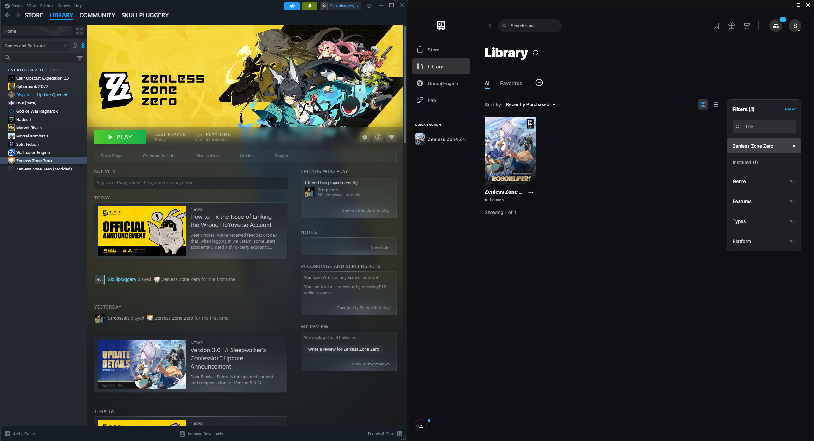

# ZZZ Dual Launcher — Steam + Epic, One Install

> Play Zenless Zone Zero on Steam. Top up on Epic. Pay zero extra gigabytes.



ZZZ launched on Steam on June 17, 2026 — and with it came a dilemma.

---

## Why?

Epic Games regularly offers **20–30% discounts on top-ups** through their regional pricing and coupon system. Steam, on the other hand, has the **community hub, playtime tracking, achievements, and your friends list**. Naturally, you want both.

The problem? Installing ZZZ on both launchers means duplicating a **70+ GB install** just to get the best of two stores.

You shouldn't have to choose. And you definitely shouldn't have to waste 70 GB.

---

## What?

This script sets up **NTFS directory junctions and hard links** so both launchers share the exact same game data on disk — with zero duplication.

Each launcher stays fully independent: its own HoYoPlay, its own channel config, its own update manifest. Only the actual game files are shared.

|                            | Steam       | Epic              |
| -------------------------- | ----------- | ----------------- |
| HoYoPlay launcher          | Own copy    | Own copy          |
| `config.ini` (channel ID)  | `cps=Steam` | `cps=mihoyo`      |
| Sophon manifests           | Own copy    | Own copy          |
| `ZenlessZoneZero_Data/`    | **Source**  | Junction → Steam  |
| Game binaries (DLLs, .exe) | **Source**  | Hard link → Steam |
| Disk space used            | ~76 GB      | ~800 MB           |

**Total savings: ~75 GB.**

### How it works under the hood

- **Directory junction** — An NTFS feature that makes a folder appear in two places simultaneously. Zero extra disk space. Epic's `ZenlessZoneZero_Data/` points directly to Steam's copy.
- **Hard link** — Two filenames sharing the exact same data on disk. Used for game binaries (`.dll`, `.exe`). Updates to one are instantly reflected in the other.
- **Not shared** — `config.ini`, Sophon manifests, `steam_appid.txt`. Each launcher writes these itself so it recognizes the install as its own channel.

---

## How?

### Prerequisites

- Windows (NTFS filesystem required — junctions don't work on FAT32/exFAT)
- Both installs **must be on the same drive** (NTFS junctions can't cross drive letters)
- ZZZ fully installed on one launcher (the **source**)
- ZZZ install started on the other launcher, then **paused right after the launcher files appear** — before the 70 GB game data downloads

### Setup

**1. Download `setup-dual-launcher.ps1`**

1. Locate the file in this repository.
2. Click **Download raw file**.

**2. Start installing ZZZ on your second launcher and pause at the right moment**

The timing depends on which launcher you're setting up as the destination:

**Steam**

1. Start downloading ZZZ. Wait until the download reaches at least 1–2%.
2. Pause the download.
3. Run the script (see Step 3).
4. Once the script finishes, go to your **Library** and find Zenless Zone Zero.
5. Click the cog/settings icon → **Installed Files** → **Verify integrity of game files**.
6. Done.

**Epic**

1. Start the installation. Wait for the launcher files to finish downloading — you'll see a prompt to **Install Game Data**. Do not click it yet.
2. Run the script (see Step 3).
3. Go back to the Epic launcher, click **Find Installed Game**, and point it to the folder containing `ZenlessZoneZero.exe`.
4. Done.

**3. Run the script as Administrator**

```powershell
powershell -ExecutionPolicy Bypass -File setup-dual-launcher.ps1
```

The script will walk you through it interactively:

```
===================================================
  ZZZ Dual Launcher Setup
===================================================

Which launcher has the FULL game install (the source)?
  [1] Epic Games  (default)
  [2] Steam

Enter 1 or 2 (or press Enter for default): 2

Source game folder path?
  This should be the folder containing ZenlessZoneZero.exe
  Default: D:\Program Files (x86)\Steam\...\ZenlessZoneZero Game

  Source verified.

===================================================
  Summary
===================================================

  JUNCTIONS  -- 2 folders, ~70.4 GB shared, zero extra disk
  HARD LINKS -- 20 files, ~0.6 GB, zero extra disk
  EXCLUDED   -- 6 files, Epic launcher will download these fresh

Proceed? [Y/N]:
```

**4. Resume the download on the second launcher**

Sophon (HoYoverse's downloader) will scan the folder, see the game data already present via junction, and only download the missing channel-specific files. No re-downloading 70 GB.

---

## Sample Run

```
PS C:\WINDOWS\system32> powershell -ExecutionPolicy Bypass -File "D:\Program Files\Epic Games\ZenlessZoneZero\setup-dual-launcher.ps1"

===================================================
  ZZZ Dual Launcher Setup
===================================================

Which launcher has the FULL game install (the source)?
  [1] Epic Games  (default)
  [2] Steam

Enter 1 or 2 (or press Enter for default): 2
  Source  : Steam
  Target  : Epic (will receive junctions/hard links)

Source game folder path?
  This should be the folder containing ZenlessZoneZero.exe
  Default: D:\Program Files (x86)\Steam\steamapps\common\Zenless Zone Zero\games\ZenlessZoneZero Game
  Press Enter to use default, or paste a custom path.

Source path:
  Source verified.

Destination game folder path?
  This is where junctions/hard links will be created (the Epic install).
  Default: D:\Program Files\Epic Games\ZenlessZoneZero\games\ZenlessZoneZero Game
  Press Enter to use default, or paste a custom path.

Destination path:
  Destination verified.

===================================================
  Summary
===================================================

  Source  : D:\Program Files (x86)\Steam\steamapps\common\Zenless Zone Zero\games\ZenlessZoneZero Game
  Target  : D:\Program Files\Epic Games\ZenlessZoneZero\games\ZenlessZoneZero Game

  JUNCTIONS  -- 2 folders, ~74.33 GB shared, zero extra disk:
    + APMCrashReporter
    + ZenlessZoneZero_Data

  HARD LINKS  -- 20 files, ~0.71 GB, zero extra disk:
    + amd_ags_x64.dll
    + amd_fidelityfx_framegeneration_dx12.dll
    + amd_fidelityfx_loader_dx12.dll
    + amd_fidelityfx_upscaler_dx12.dll
    + GameAssembly.dll
    + HoYoKProtect.sys
    + mhypbase.dll
    + nvngx_dlss.dll
    + nvngx_dlssd.dll
    + nvngx_dlssg.dll
    + sl.common.dll
    + sl.dlss.dll
    + sl.dlss_g.dll
    + sl.interposer.dll
    + sl.nis.dll
    + sl.pcl.dll
    + sl.reflex.dll
    + UnityCrashHandler64.exe
    + UnityPlayer.dll
    + ZenlessZoneZero.exe

  EXCLUDED    -- 6 files, Epic launcher will download these fresh:
    - config.ini
    - file_category_launcher
    - pkg_version
    - sdk_pkg_version
    - steam_appid.txt
    - version_info

Proceed? [Y/N]: Y


=== Creating junctions ===
  SKIP (already linked)  APMCrashReporter
  SKIP (already linked)  ZenlessZoneZero_Data

=== Creating hard links ===
  SKIP (exists)  amd_ags_x64.dll
  SKIP (exists)  amd_fidelityfx_framegeneration_dx12.dll
  ...

===================================================
  Done!
===================================================

  Resume the Epic download.
  Sophon will scan the folder and only download the excluded channel files.
```

---

## Updating the game

**Always update through your primary launcher (whichever has the real files).**

- `ZenlessZoneZero_Data/` updates automatically propagate to the other launcher via junction.
- Hard-linked binaries (e.g. `GameAssembly.dll`) update in place — both launchers see the change instantly.
- After a major patch, let the secondary launcher verify files once so it can refresh its own manifests.

---

## What we tried that didn't work

| Approach                                           | Why it failed                                                                              |
| -------------------------------------------------- | ------------------------------------------------------------------------------------------ |
| Junction the entire `ZenlessZoneZero Game/` folder | Shared `config.ini` → _"game resources do not belong to the same channel"_                 |
| Hard-link launcher files (HYP.exe, DLLs)           | Steam's HoYoPlay auto-updated, corrupting Epic's manifest checksums → `IS-IN-MF02-5` error |
| Junction Steam root directly into Epic root        | Wrong layout — Steam expects a `games\ZenlessZoneZero Game\` subfolder                     |

The key insight: **launcher files must never be shared.** Only the game data (`ZenlessZoneZero_Data/`) and game binaries (identical across all channels) can be safely linked.

---

## FAQ

**Will my game account or progress be affected?**
No. ZZZ uses your HoYoverse account regardless of launcher. Both launchers connect to the same account and the same servers.

**What if Steam and Epic release updates at different times?**
Always update through your primary launcher. The secondary launcher will pick up game data changes automatically via the junction. Just let it verify files before playing through it again after a patch.

**Does this work for other HoYoverse games (Genshin, HSR)?**
The same technique applies — the channel separation logic (`config.ini`, Sophon manifests) is identical across all HoYoPlay titles. Folder names and default paths will differ.

**My drive setup is different (custom install paths).**
The script prompts you to enter custom paths and validates them. It checks for `ZenlessZoneZero.exe` to confirm you've pointed it at the right folder.

---

## Contributing

Tested with ZZZ 3.0.0 on Windows 11. If you run into issues with a newer version (new files added, folder structure changed), please open an issue with the output of:

```powershell
Get-ChildItem "your\ZenlessZoneZero Game\path" | Select-Object Mode, Name
```

PRs welcome, especially for:

- Other HoYoverse games (Genshin Impact, Honkai Star Rail, Honkai Impact 3rd)
- Detection of already-linked files on re-runs
- Linux/Proton support (symlinks instead of junctions)

---

## License

MIT
